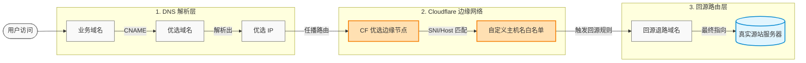

# 浅谈对 Cloudflare IP 优选的理解

## 核心原理

Cloudflare IP 优选的核心目的，是绕过 Cloudflare 默认分配的高延迟或绕路节点，强制让用户的网络流量通过低延迟、低丢包率的优质边缘节点接入，从而提升国内访问速度。该架构依赖两个技术机制：

1. **ip优选**：利用智能 DNS 解析，根据用户所处的运营商（电信、联通、移动），返回对应的测速最优 IP。
2. **自定义主机名鉴权（Cloudflare for SaaS）**：允许业务域名通过任意优选出的 CF IP 接入，并安全映射到预设的回源退路，最终通过内部网络送达真实源站。

### 完整数据链路闭环

需要注意的是，这里的回源退路域名需要开启cf代理，当你开启cf代理时，你解析这个域名就会访问到cf的边缘节点，然后边缘节点会代替去你访问指定网站，但是在优选后会让你绕过cf解析给你的默认节点，直接访问到优选后的边缘节点，从而加快对网站的访问。

---

## 应用场景与实例

### 优选ip

* **统优选域名**
常用的社区优选域名：`https://cf.090227.xyz`

### 常规域名优选（最常见方案）

* **适用场景**：你有一个源站需要用域名访问（域名 CNAME 接入方式）。

* **准备工作**：
 1. 准备两个域名，这两个域名可以来自同一个根域名，或者不同的根域名，但是其中一个必须添加到cloudflare里面，否则无法使用该功能
 2. 你还需要开通自定义主机名的功能，这需要银绑定行卡或者虚拟卡亦或者Paypal，不用过它是免费的
 3. 这里我们把cloudflare里的域名作为辅助域名`fuzhu.com`，另一个可以使用任意一个域名`example.com`，

* **具体步骤**：
 1. 在cf里用辅助域名新建一个dns解析，指向源站，比如可以直接使用根域名`fuzhu.com`
 2. 前往辅助域名的 SSL/TLS -> 自定义主机名 ，添加一个自定义主机名，比如`www.example.com`，然后设置源服务器为刚才的`fuzhu.com`，这里推荐使用http验证，方便快捷。
 3. 在cf里添加一个CNAME解析到优选域名`https://cf.090227.xyz`，这里使用`cdn.fuzhu.com`。
 4. 将你的业务域名`www.example.com`解析到你指向优选域名的那个域名`cdn.fuzhu.com`
 5. 恭喜你，如果你的操作正确，到这里你应该可以访问了。当你访问你的业务域名`www.example.com`时，会先解析到优选域名`https://cf.090227.xyz`，然后解析到优选ip，也就是cf的边缘节点，cf的边缘节点检测到你使用了设置的自定义主机名`www.example.com`，于是回源到了你的辅助域名`fuzhu.com`，而这个域名指向了你的源站，于是你便完成了对源站的访问。